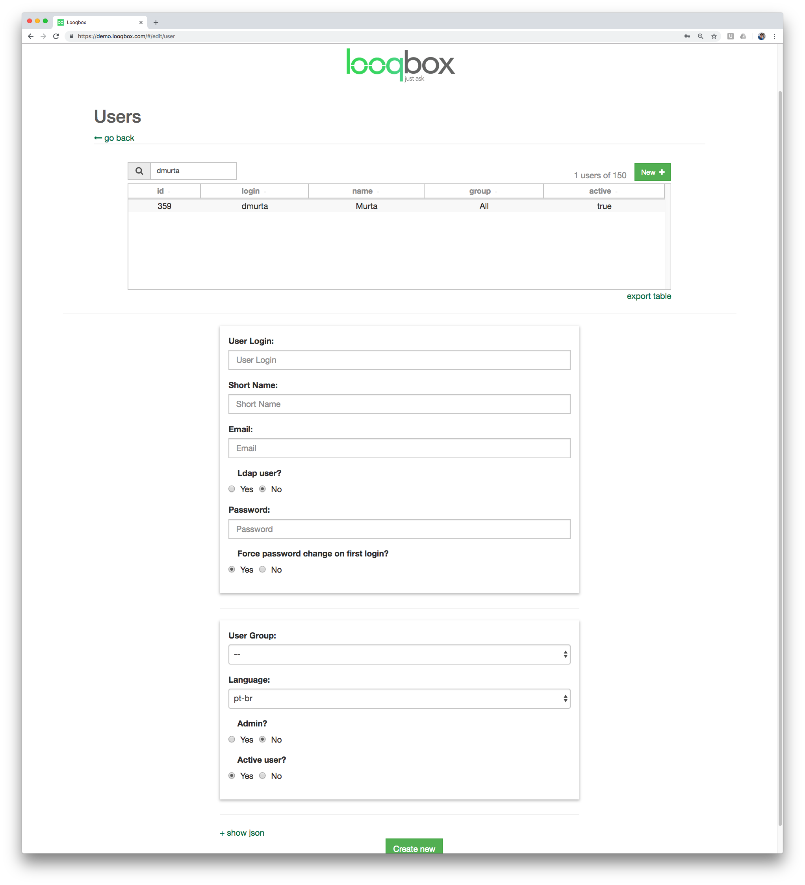
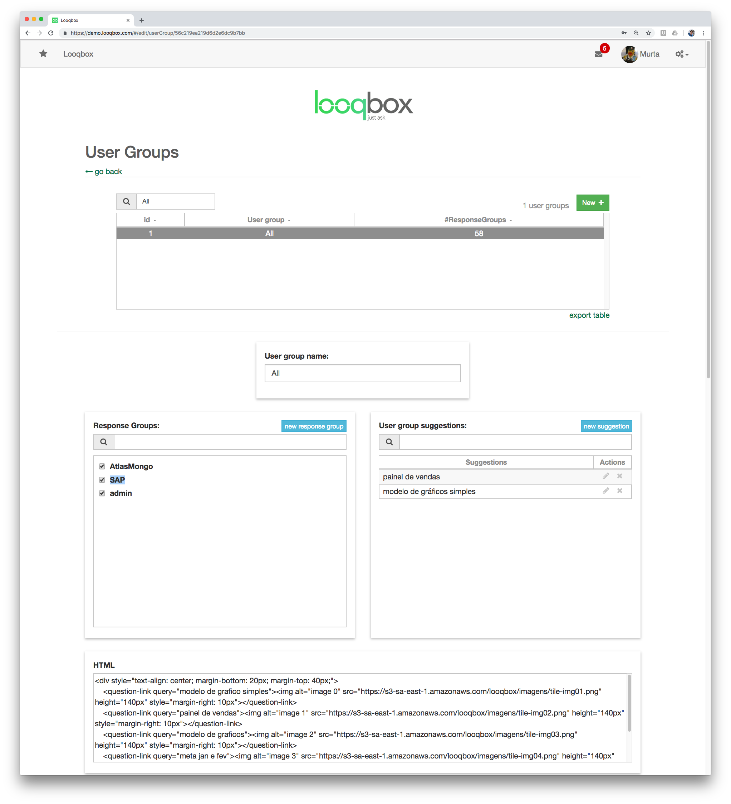
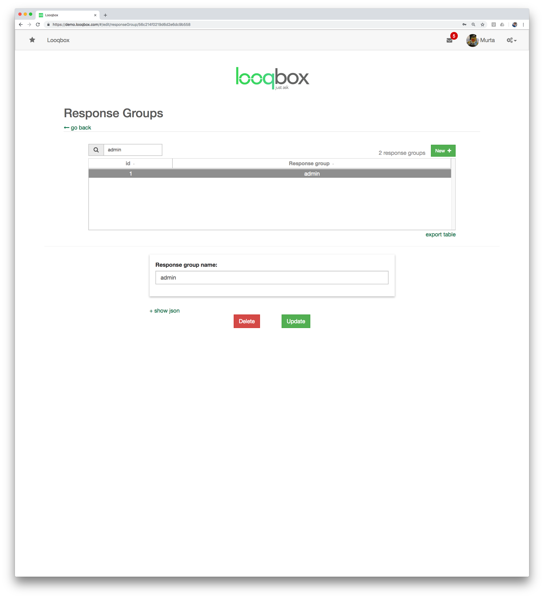

# Admin Interface

## Looqbox must be fast - Implementation Flow

There are 2 important concepts that you should know to understand our recommentation about how responses should be implemented in Looqbox.

1. Looqbox runs a R script for each question asked by the users. Each of those scripts access a datasource (e.g. MySQL), so the time that a users waits is mainly the response time from the query or API. The maximum recommended time for a response is 2 seconds.

2. Users usually need a bit of experience with the interface to start asking more complex questions, so starting with short and general questions help new users to navigate.

We discorage the implementation of complex dashboards in Looqbox, since it usually depends of multiple queries, which result in a long response time.

To guarantee the best user experience, responses should be implemented in a way that users can ask simple questions, and navigate to more specific information using features like drill down. Navigating between 4 tables of content waiting 2 seconds for each load in much better than waiting 8 seconds for a single dashboard.

Here is a sequence of questions to illustrate this scenario:

- sales $date
- sales $date by store
- sales $date by department
- sales $date by supplier

## Basics 
Following the instructions below will allow a admin to perform all kinds of tasks inside Looqbox. Many of the tasks are similar to other systems, such as creating users, connections to DBs and so on.
To help navigate quickly to the most important screens and to understand the main feature about Looqbox (NLP), you can use the commands below after a questions to execute special admin commands.

#### $debug
This is your main command to visualize the parameters that Looqbox undestands from a question. If you are getting a unexpected behavior, or if the wrong script is being run when a specific question is asked, you can use $debug to see the response, the entities retrieved from the question and so on.

(Please test the examples below. This command will be most useful in the [Entities section](#entity))

* venda ontem $debug
* top 10 produtos $debug
* meta ontem versus hj $debug
* venda do ano passado por mes $debug

#### $response
Sends the user to the [response](#creating-a-response) that Looqbox links to the script that would run with the given question.

* venda ontem $response

#### $script
Sends the user to the R script that Looqbox would run with the given question.

* venda ontem $script

## Database Connection

## Creating a response

Here you can link keywords to a script. 
We will divide this section 3 parts.

#### Basic info
Response Name: use a name to find this response easily later

Response Group: each response must belong to a response group, used to control who can access this resource

Engine: R (default) is the only engine available for scripts

Custom evaluation time limit: ATTENTION. Don't modify unless it's extremely necessary. This field is used to modify the default timeout (30s) for a script to respond. Good scripts run under 2 seconds, so there should be really no reason to modify this value

Active: (self explanatory)

#### Response files

Response files: Use this area to upload scripts or help files. The main file will/must always have the same name as the responseName. IMPORTANT: .r extension MUST be lowercase

#### Keyword Group

Language: language that will use this keyword group

Keyword: IMPORTANT. Here you can define which keywords must be present in a sentence to run this response. The script that will be executed will always be chosen by the highest number of entities found inside a question that in linked to a response.
Keywords can be divided in 2 groups:

 * simple words: usually stem or a verb in infitive. E.g. for a report about sales, use as keyword "sales", and all variations such as "sell", "sold", "selling" can be registered under [Replacements](#replacements). 
 * entities: starts with "$", and represent a pattern that can be found in the question. The most used entity is "$date", which is preimplemented by Looqbox. You can create your own entities (see [EntityByCode](#entity-by-code) and [EntityByName](#entity-by-name))

A list of synonyms can be used by separating words with pipes. E.g.: sales|revenue

Note that keywords can be optional. This is useful for entites that may appear in a question, but is not fundamental for the main usage case for a response. To illustrate:

> Imagine that it's important for a user to ask about sales "sales yesterday" (which returns a table with the sales in each store), but it's also common to modify the answer by asking "sales yesterday store 1, 2 and 3" (which returns a table with the sales of store 1, 2 and 3). In this case, the entity $store is optional, and when available, all values about store (in our example, 1 to 3) will be fowarded to the script within the entity $store.

  

## Creating User

In this section you are able to create users that will have access to Looqbox.

User Login: name used by the user to login.

Short Name: alias for the user.

Email: used when a user forgets the password.

Password: (self explanatory)

User Group: Each user must have a [User Group](#creating-usergroup). User groups are usually divided in roles inside a company (sales, marketing etc)l

Language: default language for this user.

Admin: select if a user can edit user, responses, entities and so on.

Active: (self explanatory)

  

## Creating UserGroup 

User groups are usually divided in roles inside a company (sales, marketing etc).
When [creating users](#creating-user), you can define which userGroup this user belongs to.

Response Groups: Define which [Response Groups](#creating-responsegroup) are linked to this user group. 

User Group Suggestions: Suggestions added will be shown to users that belong to this userGroup in the favorites and autocomplete.

  

## Creating ResponseGroup

Each [response](#creating-a-response) belongs to a single responseGroup. When [creating userGroups]($creating-usergroup), you can choose multiple responseGroups that access is allowed to the userGroup.

Response Group Name: define a name for a responseGroup. 

  

## Entity

Entities are patterns that can be found in the question, and retrieved as values to be used inside scripts.

The most used entity is "$date", which is preimplemented by Looqbox. Other entities can be implemented as you need.

E.g.: "sales last week" -> $date: [2018-09-10, 2018-09-16]

To visualize the sections bellow, test the examples with the [$debug command](#debug) in Looqbox's interface.

### Default entities by Looqbox

#### $date
Looqbox interprets many different ways to refer to dates. Since it's the most used entity, it's always being improved by our team. Here are some examples from thousands of combinations of how a user can refer to a date in Looqbox:

* ontem, hoje (hj), amanhã
* semana passada, mes passado, ano passado, década passada
* semana que vem, mes que vem, ano que vem, década que vem
* 1 de abril, 24 de dezembro
* setembro de 2018, janeiro do ano passado
* 1 de abril de 2018
* 28/01/1991, 02-02-2010
* segunda feira, segunda feira da semana passada, segunda da semana que vem

#### $datePartition
Used to imply a way to split date value inside a script. Those references are:

* por dia, diária, dia a dia
* por semana, semanal, semana a semana
* por mes, mensal, mes a mes
* por bimestre, bimestral, bimestralmente, bimestre a bimestre 
* (same as above for trimestre, quadrimestre, semestre)
* por ano, anual, ano a ano

#### $comparative
Comparative works by indicating a comparison between 2 $dates. For example:

* hj vs ontem
* mes passado versus retrasado
* ano semana passada versus semana atual

#### $topN
Used for ranking. $topn shows the number of elements that the user intents to select/work with. The maximum positive or negative number is 99,999.

* top 5 
* maiores 20
* menores 15
* top 8 maiores
* top 8 menores

#### $email
Used to return email found in question.

* contact@looqbox.com
* jobs@looqbox.com

#### $quotes
Anything between quotes is treated as plain text (no rules about entities will be applyed). It's commonly used to refer about product, store name and other text that must have a exact value.

* "coca cola"
* "revista abril"

#### $diamond
Similar to $quotes, any text between square brackets will be treated as exact value and will have no rules applyed over. 

* [Looqbox]
* [350ml pkg 6units]

### Entity By Code
Most used entity. With EntityByCode, you can define a pattern that, if preceded by a "head", will return a value to the R script. E.g.:

> $store

> entity head: `lojas?|filial|filiais`, entity pattern: `\d+`

>When "venda na loja 20" is asked, the R script will receive the entity $store with the value 20.

Note that the pattern \d+ is used to determine if what comes after [loja, lojas, filial, filiais] is a number, and Looqbox will already apply this pattern to a list of stores if necessary, reducing the complexity of patterns that needs to be implemented by you. E.g.:

>The same example above also works for "venda na loja 20, 21 e 22", which returns the values [20, 21, 22] to the R script.

Another way to implement EntityByCode is by combining it with [$diamond](#diamond). The advantage of using $diamond with EntityByCode can be seem in 2 cases:

1. A id is not available, and a exact text must be passed to a new question by a drill down, so it can be used to query information in the DB. 
> $store
>
> entity head: `lojas?|filial|filiais`, entity pattern: <>
>
>When "venda na loja [Fides]" is asked, the R script will receive the entity $store with the value `Fides`. Now this string can be used to query this specific name in the DB.

2. A id and a name for the entity are available, and you want to show the name of a pattern to the user, while using the id to query data in the DB.
> $store
>
> entity head: `lojas?|filial|filiais`, entity pattern: <>
>
>When "venda na loja [Fides|20]" is asked, the R script will receive the entity $store with the value 20. The advantage of this case is that the user sees a highlight with `Fides`, improving the readability of the question.

A useful feature when adding a EntityByCode is to provide a CSV with all entries that you have in your data source, so when a user types a entity head, the entity autocomplete feature will start helping the user with all possible entries provided in the CSV.

(under construction)

### Entity By Name
EntityByName is useful when there is a small amount of entries that you want to link with a value (string or number) to be used in R scripts.

This is recommended for a fast implementation when it's known that a user has no knowledge about the id of a entity and types the name of this entity. For cases with a long list of possibilities, we recommend implementing [EntityByCode](#entity-by-code) and upload a CSV with all entries, so the entity autocomplete feature can be used by the user asking the question.

Here are some examples:

> $city, output: number
> 
> prefix: cidade
>
> from: salinas, to: 1
>
> from: belem, to: 2
>
> When "venda na cidade Belem" is asked, the R script will receive the entity $city with the value 2.

(under construction - example with output:string)

## Replacements

