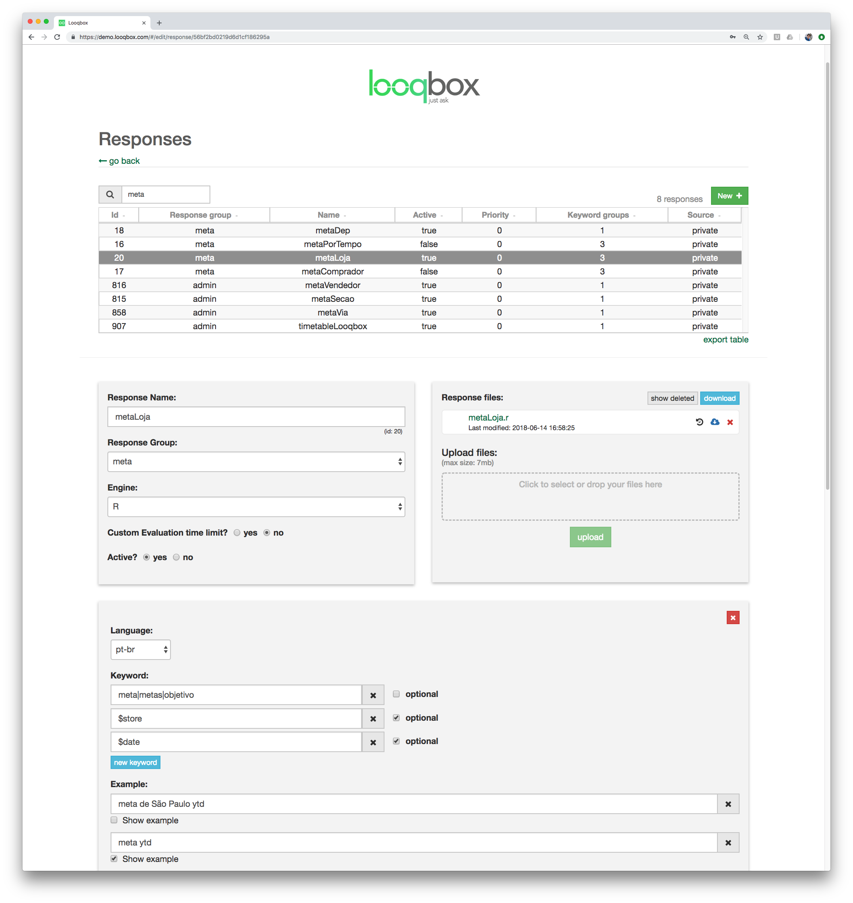

# Admin Interface

## Looqbox must be fast - Implementation Flow

There are 2 important concepts that you should know to understand our recommentation about how responses should be implemented in Looqbox.

1. Looqbox runs a R script for each question asked by the users. Each of those scripts access a datasource (e.g. MySQL), so the time that a users waits is mainly the response time from the query or API. The maximum recommended time for a response is 2 seconds.

2. Users usually need a bit of experience with the interface to start asking more complex questions, so starting with short and general questions help new users to navigate.

We discorage the implementation of complex dashboards in Looqbox, since it usually depends of multiple queries, which result in a long response time.

To guarantee the best user experience, responses should be implemented in a way that users can ask simple questions, and navigate to more specific information using features like drill down. Navigating between 4 tables of content waiting 2 seconds for each load in much better than waiting 8 seconds for a single dashboard.

Here is a sequence of questions to illustrate this scenario:

- sales $date
- sales $date by store
- sales $date by department
- sales $date by supplier

## Database Connection

## Creating a response

Here you can link keywords to a script. 
We will divide this section 3 parts.

#### Basic info
Response Name: use a name to find this response easily later

Response Group: each response must belong to a response group, used to control who can access this resource

Engine: R (default) is the only engine available for scripts

Custom evaluation time limit: ATTENTION. Don't modify unless it's extremely necessary. This field is used to modify the default timeout (30s) for a script to respond. Good scripts run under 2 seconds, so there should be really no reason to modify this value

Active: (self explanatory)

#### Response files

Response files: Use this area to upload scripts or help files. The main file will/must always have the same name as the responseName. IMPORTANT: .r extension MUST be lowercase

#### Keyword Group

Language: language that will use this keyword group

Keyword: IMPORTANT. Here you can define which keywords must be present in a sentence to run this response. The script that will be executed will always be chosen by the highest number of entities found inside a question that in linked to a response.
Keywords can be divided in 2 groups:

 * simple words: usually stem or a verb in infitive. E.g. for a report about sales, use as keyword "sales", and all variations such as "sell", "sold", "selling" can be registered under [Replacements](#replacements). 
 * entities: starts with "$", and represent a pattern that can be found in the question. The most used entity is "$date", which is preimplemented by Looqbox. You can create your own entities (see [EntityByCode](#entity-by-code) and [EntityByName](#entity-by-name))

A list of synonyms can be used by separating words with pipes. E.g.: sales|revenue

Note that keywords can be optional. This is useful for entites that may appear in a question, but is not fundamental for the main usage case for a response. To illustrate:

> Imagine that it's important for a user to ask about sales "sales yesterday" (which returns a table with the sales in each store), but it's also common to modify the answer by asking "sales yesterday store 1, 2 and 3" (which returns a table with the sales of store 1, 2 and 3). In this case, the entity $store is optional, and when available, all values about store (in our example, 1 to 3) will be fowarded to the script within the entity $store.

  

## Creating User

In this section you are able to create users that will have access to Looqbox.

User Login: name used by the user to login.

Short Name: alias for the user.

Email: used when a user forgets the password.

Password: (self explanatory)

User Group: Each user must have a [User Group](#creating-usergroup). User groups are usually divided in roles inside a company (sales, marketing etc)l

Language: default language for this user.

Admin: select if a user can edit user, responses, entities and so on.

Active: (self explanatory)

  

## Creating UserGroup 

User groups are usually divided in roles inside a company (sales, marketing etc).
When [creating users](#creating-user), you can define which userGroup this user belongs to.

Response Groups: Define which [Response Groups](#creating-responsegroup) are linked to this user group. 

User Group Suggestions: Suggestions added will be shown to users that belong to this userGroup in the favorites and autocomplete.

  

## Creating ResponseGroup

Each [response](#creating-a-response) belongs to a single responseGroup. When [creating userGroups]($creating-usergroup), you can choose multiple responseGroups that access is allowed to the userGroup.

Response Group Name: define a name for a responseGroup. 

  

## Entity

Entities are patterns that can be found in the question, and retrieved as values to be used inside scripts.

The most used entity is "$date", which is preimplemented by Looqbox. Other entities can be implemented as you need.

E.g.: "sales last week" -> $date: [2018-09-10, 2018-09-16]

### Default entities by Looqbox

#### $date

#### $datePartition

#### $comparative

#### $topN

#### $email

#### $quotes

#### $diamond

### Entity By Code

### Entity By Name

## Replacements