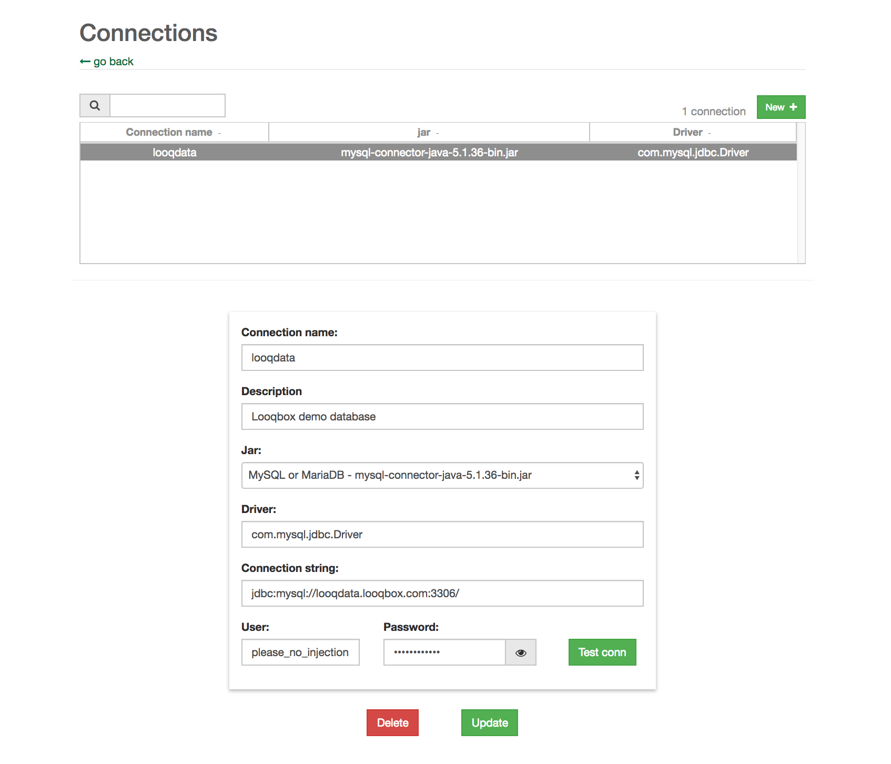

# Cookbook

This section provides well known use scenarios for Looqbox, and how to implement them.

Each section below has a __scenario__ and a __solution__. We recommend you to read all scenarios, and if any of them apply to you, follow the related instructions.

## Example 1 - Implementing a response with access to a database

#### Scenario
In this section you can see how to implement the main type of response in Looqbox!

Questions such as "venda ontem" are the most fundamental for users. They are usually composed by a simple keyword + a entity (in this case $date). We are going to see how to implement a response with a query to a DB, and a filter based on date.

#### Solution

##### Step 1: Add a connection to a database

Add a database connection if you don't have one already. To see the basics about adding a connection, [**click here**](/admin-interface#database-connection).
Your connection screen should be similar to the image below:

<br/>
<div align="center">
  
  <p></p>
</div> 
<br/>

It's important to notice that the connection's name that you chose will be used in the R script.

<br/>
##### Step 2: Create a response

You can see the basics about creating a response [**here**](/admin-interface#creating-a-response).

Go to Admin > Responses and fill the fields just like in the image below:

<br/>
<div align="center">
  
  <p></p>
</div> 
<br/>

Hit Create New at the bottom.

Now you have a response that will be executed whenever a user types "venda" and any variation of a date. "venda ontem", "venda hj", "venda na segunda quinzena de abril de 2017".

<br/>
##### Step 3: Add a script

```looqbox
library("looqbox")

#-----------------------------------------------------------------------------#
#----  get.data
#-----------------------------------------------------------------------------#

# get.data is one of the 3 main functions when creating a script. It's a logical
# division in the script to gether information from a data source.
# In this case, it's receiving a dateInt (date interval) and a storeList
get.data <- function(dateInt,storeList) {

  # The query below will run against the database, and can accept filters in 2 forms.
  # 1 - Numbers between back ticks (``): for mandatory filters, use `1` and `2` and 
  # so on as placeholders. Those placeholders will be replaced by values passed 
  # during the looq.sqlExecute 
  # 2 - looq.sqlIn function: for optional variables, you can use this funcion. 
  # looq.sqlIn accepts 2 arguments. The first one is a segment of the query, and 
  # the second in a variable. If the variable (in this case storeList) is NULL, 
  # the funcion returns a empty string, not affecting in any way the query. If the 
  # variable has a value, the second argument will be pasted (between brackets) along 
  # with the first argument in the query.

  #####
  ##### IMPORTANT: change the query so that it matches you database!
  #####
  sql <- paste(
    "
    SELECT
    c.STORE_NAME as Loja
    ,sum(s.SALES_VALUE) as Venda
    FROM looqdata.data_store_sales as s
    inner join
    looqdata.data_store_cad as c
    using(STORE_CODE)
    where 1=1
    and date(s.DATE) between date(`1`) and date(`2`)
    ", looq.sqlIn("and s.STORE_CODE in ",storeList),"
    group by c.STORE_NAME
    order by 1"
  )

  # looq.sqlExecute receives 3 arguments.
  # 1 - A connection name, created in Looqbox's interface in Admin > Connections
  # 2 - A query, like the "sql" variable created above
  # 3 - A list of parameters that will replace the placeholder (`1`, `2` ...) in the given order
  #
  # The query run, and the result is a objTable (a object that can be already 
  # displayed in Looqbox's interface). This table is stored in the atribute $date
  # of the given variable (in this case, r$data)

  #####
  ##### IMPORTANT: Remember to use the name of the connection that you set up in step 1!
  #####
  r <- looq.sqlExecute("looqdata", sql, list(dateInt[1],dateInt[2]))

  # If a table returns with empty content, the code stops here and a message is returned to the user
  # This section prevents the script to attempt to manipulate data of a empty table
  if(r$rows == 0) return(paste("Sem dados no período de:\n", dateInt[1], "a", dateInt[2]))

  # Rename columns, so it's easier to work with the table throughout the code
  names(r$data) <- c("Loja", "Venda")
  
  # This attribute creates a footer for the table, with a hardcoded value, and a calculated value
  r$total <- list("Total",sum(r$data$Venda))
  
  # $title creates a title above the table when the table is presented in 
  # the interface. It can receive a string or a vector of strings (which will be stacked)
  r$title <- c("Vendas",
               # looq.titleForList verifies if there is a storeList. If 
               # there is, executes a paste0() to create a segment of the title
               looq.titleForList("Loja: ", storeList),
               # looq.titleWithDate() formats the date received to show in the title above the table
               looq.titleWithDate("Período", dateInt)
  )
  
  # $valueFormat receives a named list ("column"="format","column2"="format2") to format the columns. 
  # The available formats are: "number:n", "percent:n", "date" e "dateTime"
  # "n" is the number of decimals
  r$valueFormat <- list(
    "Venda" = "number:0"
  )
  
  # The same as above, but for the total line
  r$totalValueFormat <- list(
    "Venda" = "number:0"
  )
  
  # $paginationSize controls the default amount of lines in a table before pagination.
  # It's a important feature when bigger tables should be shown in the interface
  r$paginationSize <- 15
  
  # looq.responseFrame() displays in the interface the objects in the order that they are inputed. 
  # In this case, it's only the objTable (r)
  looq.responseFrame(r)

}

#-----------------------------------------------------------------------------#
#---  Response
#-----------------------------------------------------------------------------#

# Looqbox's main function. This function is called by the system when a script is executed.
# All scripts must have this funcion implemented.
# All parameters comprehended by Looqbox's Cloud are passed in the argument "par".
looq.response <- function(par){
  
  # looq.lookTag() retrieves entities found in the user's question.
  # If a entity is not found, NULL is returned. It's possible to define a default 
  # value when a entity is not found. In the example below, this feature is used
  # with the entity $date (used today's date if none is found in the user's question)
  stores <- looq.lookTag("$store", par)
  date <- looq.lookTag("$date", par, list(c(Sys.Date(), Sys.Date())))
  
  # looq.map() maps the value of the entities to get.data
  looq.map(get.data, date, list(stores))
}

#-----------------------------------------------------------------------------#
#---  Test Block
#-----------------------------------------------------------------------------#

# This block is used to test scripts in RStudio or in Admin > Test Scripts
# Here you can define hardcoded values to simulate the entities found in a question
# and simulate the behavior of your script
looq.testQuestion(
  list(
    "$date"=list(c('2014-02-01','2014-02-28'))
    ,"$store"=c()
  )
)

```

<br/>
##### Step 4: Test

Click at "Looqbox" in the upper left corner, and type "venda na semana passada". You should see a response similar the one below:

<br/>
<div align="center">
  
  <p></p>
</div> 
<br/>

you can also type $debug after your question to see how dates are being 


## Example 2 - Retrieving patterns from questions

#### Scenario
For questions such as: "venda na loja Fides". We would expect "Fides" do be retrieved as a value for the `$store` entity. But how should that entity be registered?

#### Solution 1 - Entity By Code ($store)

One good option is to register `$store` as a string-type entity, unsing diamonds(`<>`) as the pattern and `lojas?` as the entity head. As you can see below:

<br/>
<div align="center">
  
  <p></p>
</div> 
<br/>


#### Solution 2 - Entity By Code ($store + autocomplete)

Another option, and perhaps the most stylish, is to register `$store` as either a string- or digit-based entity by code and add an autocomplete `.csv` file. This will enable looqbox to suggest the entity in real time as you type in your search. The `.csv` should have one of the formats shown below: 

```looqbox
#For digit-based code-value entities

code;value
0;example
1;Store
2;Fides
3;test

#For string-based value only entities

value
example
Store
Fides
test
```


