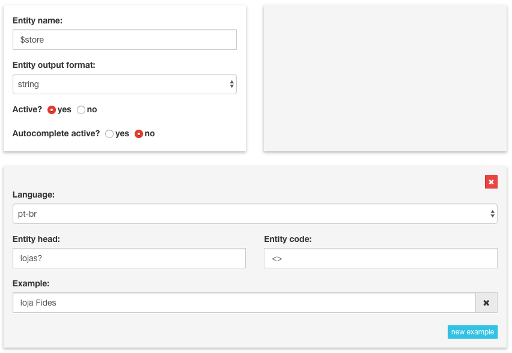

# Cookbook

This section provides well known use scenarios for Looqbox, and how to implement them.

Each section below has a __scenario__ and a __solution__. We recommend you to read all scenarios, and if any of them apply to you, follow the related instructions.


## Example 1 - Retrieving patterns from questions

#### Scenario
For questions such as: "venda na loja Fides". We would expect "Fides" do be retrieved as a value for the `$store` entity. But how should that entity be registered?

#### Solution 1 - Entity By Code ($store)

One good option is to register `$store` as a string-type entity, unsing diamonds(`<>`) as the pattern and `lojas?` as the entity head. As you can see below:

<br/>
<div align="center">
  
  <p></p>
</div> 
<br/>


#### Solution 2 - Entity By Code ($store + autocomplete)

Another option, and perhaps the most stylish, is to register `$store` as either a string- or digit-based entity by code and add an autocomplete `.csv` file. This will enable looqbox to suggest the entity in real time as you type in your search. The `.csv` should have one of the formats shown below: 

```looqbox
#For digit-based code-value entities

code;value
0;example
1;Store
2;Fides
3;test

#For string-based value only entities

value
example
Store
Fides
test
```


