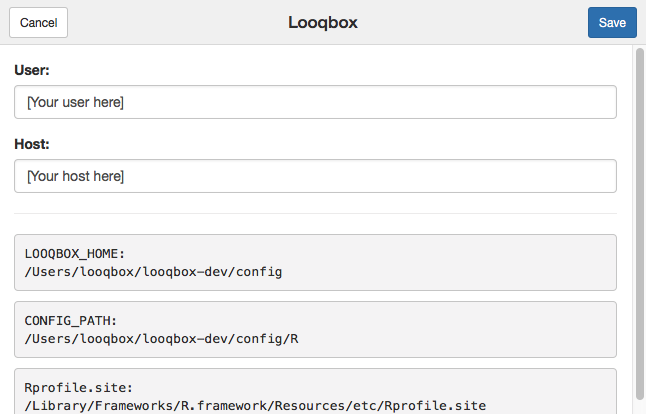

# R Scripts 

> This tutorial assumes you don't have any previous knowledge in the Looqbox Package.

<!--
## Prerequisites

- R knowledge
-->

## Setup for the Tutorial

This documentation's objective is to introduce you to the guidelines for creating organized and efficient R scripts for Looqbox as well as to make you confortable with the looqbox package and with the tool's environment and workflow. In this section we will focus on the creation and editing of the R scripts, so we recomend using Rstudio as the development environment.

You can either write the code in your RStudio Serve, or you can set up a local development environment on your computer and use your local RStudio.


### RStudio Serve Setup

This is the quickest way to get started!

Open your looqbox instance on port 8787 (usually: [http://localhost:8787](http://localhost:8787)), enter **rstudio** as username and the **password** you created in the [installation](#installation) and you're almost ready to go.

Under addins, select Looqbox and enter your looqbox **username** and **host** (if they're not already there).

<p align="center">
  
</p> 

It is also recomended to have Looqbox opened on another tab, as your tests will be published there.

You now have everything you need to begin, go ahead to the [basics section](#basics).

## Basics

### Script sctructure

In this section, you'll learn about the structure that your script should be implemented.

#### Dependencies

In order to develop a script for Looqbox you should use our Looqbox Package. The package allows you to interact with the interface and help you structure your data to be displayed in our client.

```looqbox
library(looqbox)
```

#### get.data

#### looq.response

This block is where your script will start the execution, simulating a main function. Inside it, you should use `looq.lookTag()`  to receive the value inside a looqbox tag from the parser.

In this case, we are creating a looqbox standard message box and storing it in msg variable. In the first parameter we're passing a `paste` with the string collected above. The second parameter is the style type to display the box. 

Finally, we are creating a looqbox frame to be placed inside a board with `looq.responseFrame()`.

```looqbox
looq.response <- function(par) {
  
  # Receives the value inside a looqbox tag. In this case, we're looking for 
  # $quotes tag and storing it in quotes
  quotes <- looq.lookTag("$quotes", par)
  
  # Creates a looqbox standard message box and store it in msg variable. In
  # the first parameter we're passing a paste with the string collected above
  # the second parameter is the style type to display the box. 
  msg <- looq.objMessage(
    paste("Hurray, my installation is working!!\n", quotes),
    "alert-success"
  )
  
  # Creates a looqbox frame to be placed inside a board
  looq.responseFrame(msg)
}
```

#### Test Block

This block is used to test your response from **RStudio**, allowing you to simulate our parser and test your script without saving it in Looqbox client. If you have configured your Looqbox addin correctly, you can run your script using **Ctrl + Shift + S** and it will be displayed in your client.

```looqbox
looq.testQuestion(
  list(
    "$quotes" = "My test sentence"
  )
)
```

### Essential functions

Now that you have a general understanding of how a script is properly constructed, let us go over a few of the package's most important functions. 

NOTE: In this material we'll be working with practical examples. If you wish to understand the full depth and parameters of each of these functions please refer to the package documentation.

#### looq.lookTag

Normally, the first thing your code will do once it enters your `looq.response()`(main) function, is receive information from the parser (in JSON format). From this, we have to extract information such as entities and tags, which will be used as parameters in `get.data()`. 

- `looq.lookTag()` acomplishes this task, searching for specific tags and returning their values.

```looqbox
company <- looq.lookTag("$company", par)
```
In the example above, `looq.lookTag` takes two parameters:

- `"$company"`: The entity or pattern it will search for. 
- `par`: the parser string, as received by `looq.response(par)` 

It will then, return the company value and assign it to the variable `company`.

If a certain value is an optional parameter for a question, `looq.lookTag()` also accepts a third parameter for setting a default value (should be a list). 

```looqbox
date <- looq.lookTag("$date", par, list(c('2018-01-01', '2019-01-01')))
```
In the code above, if no `$date` value is recognised by the parser it will choose the default, in this case, the period starting yesterday and ending today (whenever that is).

#### looq.map
This function is, perhaps, the core of the whole script.
```looqbox
looq.map(get.data, date, company)
```
What it does is fairly simple, the first argument is your `get.data()` function, and the remaining are  variables defined by `looq.lookTag()`. 

- `looq.map()` calls the function and passes the variables as arguments to it.
- Additionally, it wraps everything in a Looqbox response frame making `get.data`'s 
output intelligible by the interface. 

#### looq.sqlExecute
Now that we've got `looq.response` covered, we'll go inside `get.data`. Think of it as the backstage of your script, it's where everything is prepared so that your main function keeps neat.

Most of our scripts involve some kind of query to a database, `looq.sqlExecute()` is a funtion that makes this interaction extremely simple. 

```looqbox
# We generally store looq.sqlExecute's output in a variable called r
r <- looq.sqlExecute("mySQLDev", sql, list(dateInt[1], dateInt[2], company, value))

# A simple error test follows the query, checking for data absence
if(r$rows == 0) return(paste("No data found from:\n", dateInt[1], "to", dateInt[2]))
```
Normally it will take three arguments:

- `"mySQLDB"`: the database's name, as it was registered in the interface under connections.
- `sql`: a string containing the SQL query (we'll cover it in depth) 
- `...`: a list of parameters that will be inserted into the query.

In a simple manner, `looq.sqlExecute` does exatly what the name implies, it executes your query within the database, but more than that, it lets you insert values in the query. Take the following example string:

```looqbox
sql <- "
	SELECT
		EXAMPLE,
		TEST,
		FIELD,
		DATE
	FROM example.table
	WHERE 1=1			
		AND DATE >= DATE_ADD(`1`, INTERVAL +3 HOUR) 
		AND DATE < DATE_ADD(`2`, INTERVAL +3 HOUR)
		AND COMPANY = `3`
		AND VALUE = `4`
	ORDER BY DATE DESC
"
```

The values between backticks (`` ` ` ``)  are recognised by the function and substituted with the variables passed in the third argument of `looq.SQLExecute`, in order of appearance. 

Say that:
```looqbox
company <- 0
dateInt <- c('2018-07-09', '2018-08-09')
value <- 1120
```
The query sent to the database would be:
```looqbox
SELECT
	EXAMPLE,
	TEST,
	FIELD,
	DATE
FROM my.exampleDB
WHERE 1=1
	AND DATE >= DATE_ADD('2018-07-09', INTERVAL +3 HOUR) 
	AND DATE < DATE_ADD('2018-08-09', INTERVAL +3 HOUR)
	AND COMPANY = 0
	AND VALUE = 1120
ORDER BY DATE DESC
```

Easy right? And it gets better, `looq.sqlExecute` returns a `looq.objTable`, an object from the package that is ready to be imported to the interface.

#### looq.objTable and it's 

The most common answer to Looqbox questions comes in the form of tables, but rather than using comon objects as `data.frame` or `tbl` we have developed a special object, which is recognised by the interface and will help you create espoke tables, as it has a number of built-in customization options.

Well go through it's most important parameters here, more advanced options will be treated in the 
[Advanced Section](#advanced).

#### Data
 
```looqbox
r$data
```
All of the data retrieved from queries or imported from elsewhere will be available in this variable, which is a `tbl`. 


#### Title

You can create a title for your table with `r$title`, which will be visible as a header. Another style option is `r$framedTitle`. Go ahead and try it out!

The `r$title` format accepts multiple lines, creating subtitles or passing other info as a header, `r$framedTitle` accepts only a string, but you may combine them to create interesting headers.

```looqbox
# Simple title
r$title <- "Simple title"

# Example with framed title
r$framedTitle <- "Framed title"

# Title with date
r$title <- c(
	"My title",
	looq.titleWithDate("Períod:", dateInt)
)
```

#### Style

Add styling to single or multiple columns through `r$value$Style`. Good examples are values that turn red if negative but green if positive. The color can be defined as either hex(#fff) or rgb(255,255,255). 

```looqbox

# Styling single column
r$valueStyle$Column <- style

# Styling multiple columns at once
r$valueStyle <- list(
	"Column1" = style,
	"Column2" = style
)
```

#### Formating my data

`r$valueFormat` lets you format numbers and dates, adding percentages, defining number of decimal points son so on.  You should write the names of each column followed by the format.

```looqbox
r$valueFormat <- list(
	"numeric column" = "number:2",
	"percent column" = "percent:2"
)
```

#### Total line

Add a total line to your table, it can be defined for each column. If a column is left blank it will be filled with `-` by default.

```looqbox
r$total <- list(
	`Column 1` = "total",
	`Column 2` = sum(r$data$`Column 2`)
)
```

#### Drill Down

To add drill down options that link to other scripts, you should use `r$ValueLink$[Your Column Here]`. The question text will be posted as a new question, efectively linking the scripts together. 

Using `paste` or `paste0` we can ad variables or values to the link, or, as you can see below, even add values from within the table, by pasting the desired `r$data$column`. 

The `"text"` parameter will add a title to your link, which is essential when multiple drills are made from the same column.

```looqbox
# Simple drill
r$valueLink$Column <- "my question text here"

# Simple drill with variable
r$valueLink$Column <- paste("my question text here with this value", 203)

# Text box drill
r$valueLink$Column <- list(
	list("text" = "by User", "link" = paste("my question with this column", r$data$Column2)),
	list("text" = "by Company", "link" = paste("my other question with this column", r$data$Column2))
)
```

#### Pagination

Adds pagination of the specified size.

```looqbox
r$paginationSize <- 25
```

#### Searchbar

Boolean that adds a searchbar to the table(`FALSE` by default). 

```looqbox
r$searchable <- T
```

## Advanced

### Other Vizualizations
#### Graphs
#### Media
#### Deeper into looq.objTable
#### looq.responseFrame

### Advanced Package Functions

## Model Scripts


