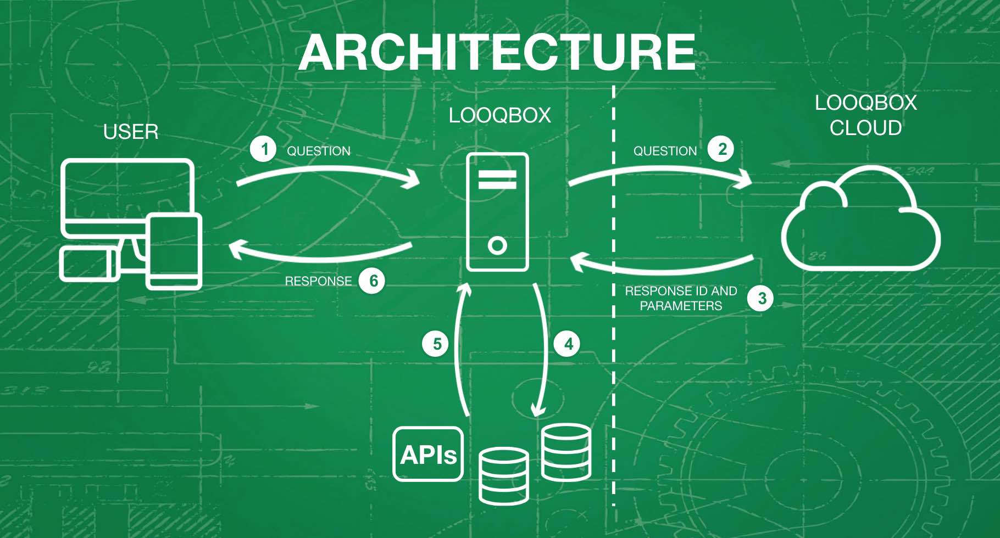

# Quickstart

Looqbox is the data search solution for your business!

Our recommendation is to implement, according to user feedback, all recurrent questions about KPIs from your business. Instead of executing the same database queries every week with different parameters to answer the same questions, just implement scripts once in Looqbox, and the users can ask as many times as they need.

As the number of responses grows, your BI team will stop wasting time repeating work that can be automated in Looqbox. 

<br>
<div align="center">
  
</div>
<br>

Your on-premise instance of Looqbox must connect to Looqbox's cloud. The cloud is used to control user access, register access groups and linguistic parameters, and (most important) understand the questions typed by users.

All users and admins connect directly to the on-premise instance. Only on-premise instances communicate with the cloud. 

This architecture allows that a simple rule of access from within your company's network must be set (add the cloud DNS to a whitelist or allow access from a firewall), while users inside the company access the local instance. If you need to use a proxy, [click here](#available-parameters).

It's important to remember that when generating a visualization for a user, your on-premise instance **doesn't send the information retrieved from your Data Sources to Looqbox's cloud**.

<div align="center">
  
</div>
<br>

## Introduction

In the sections below you'll be able to install Looqbox, login, ask your first questions and implement a response on your own!

After this Quickstart, you can:

- [Read more about the admin interface](admin-interface)
- [See common scenarios that you'll find throughout the implementation in the Cookbook](cookbook)
- [Understand how to use Looqbox's R package in scripts](r-scripts)
- [Read about Looqbox's architecture and additional parameters when initializing](read-more)

## Installation

Looqbox must be installed in a Linux distribution that supports Docker (e.g. Ubuntu 18.04 LTS). You can use either Docker CE or Docker EE, although Docker CE is free to use and should be enough to run looqbox's instance. To see Docker's documentation about compatibility, <a target="_blank" href="https://docs.docker.com/install/">click here</a>.

After <a target="_blank" href="https://docs.docker.com/glossary/?term=installation">installing Docker</a>, start Looqbox's container:

&gt;Your KEY and CLIENT values are provided by looqbox and sent through e-mail.

&gt;RSTUDIO_PASS is a password you have to choose in order to access RStudio.

```bash
docker run -d --restart=always --name=looqbox-instance -e CLIENT="<client-name>" -e KEY="<client-key>" -e RSTUDIO_PASS="<choose-a-password>" -p 80:80 -p 8787:8787 looqboxrep/fes-public:cloud002
```
To check if Looqbox started correctly, run: 

```bash
docker logs -f --tail 200 looqbox-instance
```

Expected result:
<div align="center">
  
</div>

Looqbox is now serving at port 80 and RStudio is serving at port 8787 (if it's a local instalation: <a target="_blank" href="http://localhost:80/">localhost:80</a>)

Your Looqbox instance connects to our cloud (https://cloud002.looqbox.com or host in image above). If you need to add a proxy or change Looqbox's initialization port, [click here](read-more#additional-parameters).

### Update or transfer Looqbox to another server/computer

All script files and configurations are backed up in Looqbox's Cloud. To transfer all your work between your local machine and a server or between servers, all you need to do is rerun the docker command above. It will automatically download all files to the new instance. If more than 1 instance is available, response scripts will sync in approx 45 seconds and all other information instantaneously. 

To update Looqbox and Looqbox's R package, pull the image's newest version and start a new container. For more help about docker commands to stop and update Looqbox, [click here](read-more#docker-commands-for-looqbox).


## First questions

You can test your newly installed Looqbox by using pre-implemented responses (those responses also serve as models for the responses will you implement later!).

To see the list of available questions/responses, type "que perguntas posso fazer?"

(The first question asked after starting Looqbox takes about 8 seconds to respond. [Learn more](read-more#rkernel))

## Your first response/script

Follow the steps below to create your first Response/Script. 

1. Click the cogs in the right upper corner and then in Admin (don't mistake it with the user area if the user's name you're using is "Admin"!).
2. Find `Responses` and click it.
3. Press `New +` button. Fill the following fields and leave all others with the default values:
    - **Response Name:** helloWorld
    - **Response Group:** admin
    - **Language:** pt-br
    - **Keyword:**
        - hello (press enter to open a new field)
        - world (enter)
        - script (enter)
        - $quotes
    - **Example:** hello world script "this is my first script"
4. Press the green button `Create new` at the bottom. There will be a message "file saved" at the right upper corner.

You just created your first Response! Now let's link it with a script.

5. Find `Response Files` and press `new` in `main file missing (new)`.
6. Press `+ show editor` in grey located at the left of the `save` button.
7. Copy the complete script in our [Github](/templates/helloWorld.R) or copy the code below, paste it and press `save` button. 
8. Click at Looqbox in the left upper corner to return to the search area, and type **hello world script "any message that you want"**. If the return was a green message box with the message *Hurray, my installation is working!* in the first line and the message you wrote in the second line, your installation is complete.


```looqbox
# To develop a script for Looqbox you should use our Looqbox Package.
# The package allows you to interact with the interface and help you structure
# your data to be displayed in our client.
library(looqbox)

#-----------------------------------------------------------------------------#
#---  Response
#---
#--- This block is where your script will start the execution, simulating a 
#--- main function. Inside it, you should set your parameters got from parser
#-----------------------------------------------------------------------------#
looq.response <- function(par) {
  
  # Receives the value inside a looqbox tag. In this case, we're looking for 
  # $quotes tag and storing it in quotes
  quotes <- looq.lookTag("$quotes", par)
  
  # Creates a looqbox standard message box and store it in msg variable. In
  # the first parameter we're passing a paste with the string collected above
  # the second parameter is the style type to display the box. 
  msg <- looq.objMessage(
    paste("Hurray, my installation is working!\n", quotes),
    "alert-success"
  )
  
  # Creates a looqbox frame to be placed inside a board
  looq.responseFrame(msg)
}

#-----------------------------------------------------------------------------#
#--- Test Block
#
#--- This block is used to test your response, allowing you to simulate our
#--- parser and test your script without saving it in Looqbox client.
#---
#--- If you have configured your Looqbox addin correctly, you can run your 
#--- script using Ctrl + Shift + S and it will be displayed in your client.
#-----------------------------------------------------------------------------#
looq.testQuestion(
  list(
    "$quotes" = "My test sentence"
  )
)
```
<br>
### Are you ready to learn more about Looqbox? [Click here](admin-interface) to continue.
